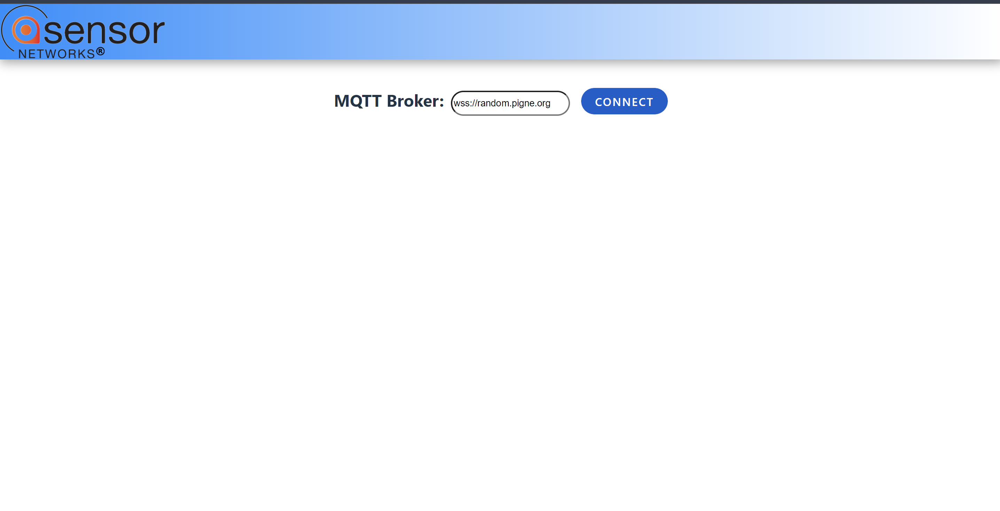
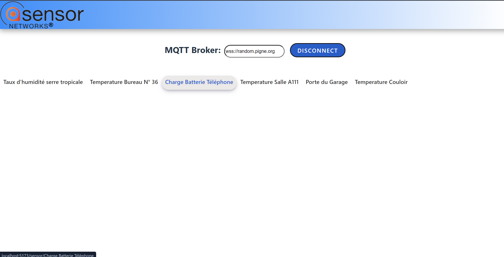
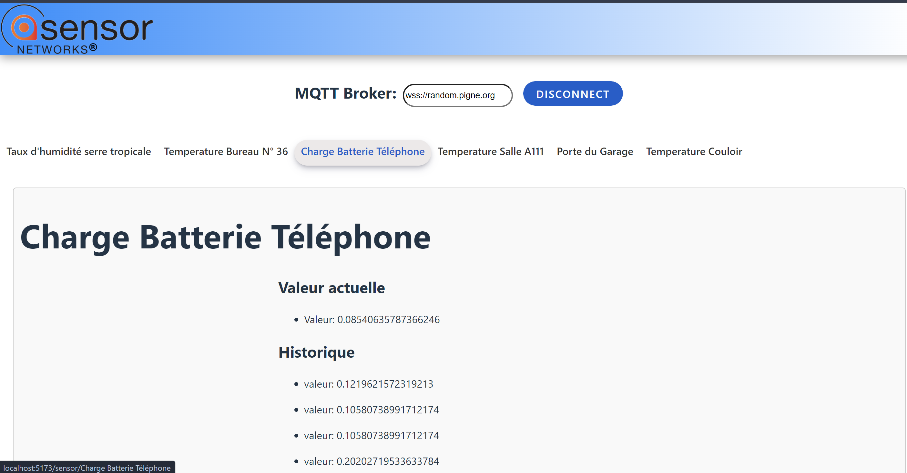

## Description du Tp

Ce Tp consiste en une application web permettant de surveiller les données provenant de capteurs IoT à l'aide d'un broker MQTT. L'application utilise React et React Router pour afficher dynamiquement les données des capteurs et permet à l'utilisateur de se connecter et se déconnecter du broker MQTT.

## Utilisation

1. Installer les dépendances nécessaires en exécutant la commande suivante : `npm install`

2. Exécuter l'application en mode développement : ``npm run dev``

3. Ouvrir votre navigateur et accéder à l'URL suivante :
``http://localhost:5173``

# Fonctionnalités

- **Connexion et déconnexion MQTT :** Permet à l'utilisateur de se connecter et se déconnecter du broker MQTT.

- **Affichage des données des capteurs :** Les données des capteurs sont affichées dynamiquement sur la page en fonction de l'URL.

## Tests

Des tests unitaires sont fournis pour tester les fonctionnalités principales de l'application. Pour exécuter les tests, utilisez la commande suivante : ``npm test``

## Captures d'écran

Voici quelques captures d'écran de l'application :

*``Page d'accueil`` qui contient le bouton et l'input de l'URL pour se connecter au broker MQTT.*

*``Menu de navigation`` après l'établissement de la connexion.*

*Affiche les données des capteurs (``l'historique`` des valeurs, la valeur ``actuelle``) .*

## Auteur

|Nom|Prénom|login|email|
|--|--|--|--|
| *LARAICH* | *Abir*| *la233225* | *abir.laraich@etu.univ-lehavre.fr* |

- Année : M1 IWOCS 2023-2024
- Matière: WEB
- TP : n°4